# WCSTNet: A Wavelet CNN Squeeze-Excitation Transformer Network for Parkinson's Disease Detection from Vertical Ground Reaction Force Signals Under Strict Subject-Level Evaluation

[](https://www.python.org/)
[](https://www.tensorflow.org/)
[](https://physionet.org/content/gaitpdb/1.0.0/)
[](#wcstnet-architecture)
[](#quantitative-results)
[](#manuscript-status)
[](LICENSE)

**A lightweight (~98K parameter) end-to-end architecture — Daubechies-4 wavelet enrichment, dual CNN blocks, Squeeze-and-Excitation sensor attention, and a Sinusoidal-Positional-Encoded Multi-Head Self-Attention Transformer Encoder — for detecting Parkinson's disease from 16-channel plantar VGRF gait signals, evaluated under strict subject-level `GroupShuffleSplit` to eliminate the data leakage endemic in prior work.**

*Subhadeep Sasmal, Indrajit Banerjee — Dept. of Information Technology, IIEST Shibpur, India*

<a id="manuscript-status"></a>
> **Manuscript status:** communicated to *Medical Physics* (Wiley), a SCOPUS-indexed Q1 journal. This repository — including full architectural specification, equations, ablation studies, and result figures — was made public prior to any editorial decision; see [Manuscript Status & Provenance](#manuscript-status--provenance) at the end of this document.

---

## Table of Contents

- [Motivation](#motivation)
- [Contributions](#contributions)
- [Dataset](#dataset)
- [Preprocessing Pipeline](#preprocessing-pipeline)
- [WCSTNet Architecture](#wcstnet-architecture)
  - [Notation](#notation)
  - [1 — Convolutional Feature Extraction](#1--convolutional-feature-extraction)
  - [2 — Squeeze-and-Excitation Sensor Attention](#2--squeeze-and-excitation-sensor-attention)
  - [3 — Sinusoidal Positional Encoding](#3--sinusoidal-positional-encoding)
  - [4 — Transformer Encoder](#4--transformer-encoder)
  - [5 — Classification Head](#5--classification-head)
- [Algorithm](#algorithm)
- [Complexity](#complexity)
- [Training Protocol](#training-protocol)
- [Evaluation Protocol](#evaluation-protocol)
- [Quantitative Results](#quantitative-results)
- [Ablation Study](#ablation-study)
- [Comparison with State-of-the-Art](#comparison-with-state-of-the-art)
- [Discussion](#discussion)
- [Limitations](#limitations)
- [Repository Structure](#repository-structure)
- [Citation](#citation)
- [Manuscript Status & Provenance](#manuscript-status--provenance)
- [Contact](#contact)

---

## Motivation

Parkinson's disease (PD) is the second most prevalent neurodegenerative disorder worldwide. The Unified Parkinson's Disease Rating Scale (UPDRS) remains the clinical gold standard for assessment, but it depends on subjective examiner observation and is therefore prone to inter-rater variability and late-stage detection. Vertical Ground Reaction Force (VGRF) signals, captured non-invasively via pressure-sensitive insoles, give an objective, continuous readout of plantar loading dynamics — the double-peak of heel-strike and push-off, inter-foot asymmetry, cadence variability — that deteriorate in characteristic ways under PD.

Two gaps motivate this work:

**1 — Evaluation-protocol leakage.** The dominant experimental protocol in prior VGRF/PD work applies $k$-fold or sliding-window cross-validation to a *pooled* window dataset, which inevitably places gait windows from the same subject in both the training and test splits. This is data leakage: the model can partly memorize a patient's individual gait signature rather than learning what makes PD gait different from healthy gait, inflating reported accuracy relative to true generalization to unseen patients.

**2 — Sequential decay in recurrent models.** CNN+BiLSTM architectures, the dominant prior approach, process gait tokens *sequentially* — an early heel-strike token must survive many hidden-state transitions before it can influence a prediction about a late toe-off token. Over a full 2-second, 47-token gait window, this causes the network's effective memory of early-cycle events to decay.

<p align="center">
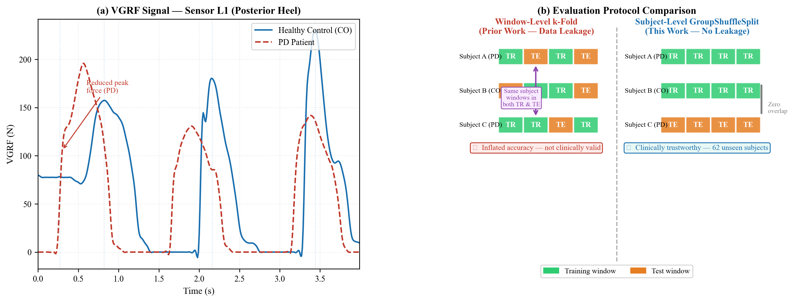
</p>

<p align="center"><em>(a) Representative VGRF trace from sensor L1 (posterior heel) — PD gait shows reduced peak force and altered loading-response dynamics relative to a healthy control. (b) Window-level k-fold splitting (prior work) leaks windows from the same subject into both train and test; subject-level GroupShuffleSplit (this work) guarantees zero subject overlap.</em></p>

WCSTNet addresses both gaps directly: a Transformer self-attention core replaces recurrence, giving every gait token a direct, non-decaying pairwise connection to every other token; and every result in this repository is reported under strict subject-level `GroupShuffleSplit`, with zero subject overlap between training and test.

## Contributions

- **WCSTNet architecture** — a CNN–SE–Transformer pipeline with Daubechies-4 wavelet multi-resolution input enrichment, Squeeze-and-Excitation channel recalibration, and a two-layer pre-norm Transformer Encoder with sinusoidal positional encoding, at only ~98K trainable parameters.
- **Rigorous evaluation** — strict subject-level `GroupShuffleSplit` with zero subject overlap across 62 held-out test subjects, eliminating the leakage endemic to window-level $k$-fold protocols used in most prior VGRF/PD work.
- **Confidence-weighted majority vote** — subject-level diagnosis aggregated from per-window predictions, weighting confident windows more heavily than borderline ones.
- **Clinical interpretability** — Transformer attention maps that localize diagnostically meaningful gait phases (terminal stance, pre-swing) without any explicit supervision to do so.

---

## Dataset

Evaluated on the **PhysioNet Gait in Parkinson's Disease (GaitPDB)** database, comprising three independently conducted studies:

| Sub-set | PD | CO | Sensors | Task |
|---|:---:|:---:|:---:|---|
| Ga | 29 | 18 | 16 | Dual-task walking |
| Ju | 29 | 25 | 16 | Rhythmic auditory stimulation |
| Si | 35 | 29 | 16 | Treadmill walking |
| **Total** | **93** | **72** | | |

All recordings used 16 pressure sensors (8 per foot) at 100 Hz, measuring VGRF in Newtons over roughly two minutes per subject.

<p align="center">
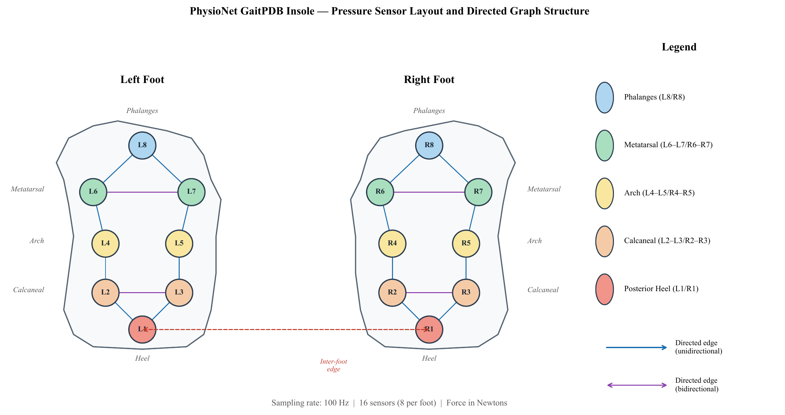
</p>

<p align="center"><em>Spatial layout of the 16 VGRF pressure sensors (8 per foot). L1/R1 sit at the posterior heel; L8/R8 at the phalanges — the anatomical path a healthy heel-to-toe loading wave follows.</em></p>

---

## Preprocessing Pipeline

Three stages, applied to every channel before windowing:

**1 — Butterworth low-pass filtering.** Each VGRF channel is filtered with a zero-phase 4th-order Butterworth low-pass filter ($f_c = 15$ Hz), forward-backward applied to suppress motion artifacts while preserving gait dynamics.

**2 — Daubechies-4 (db4) wavelet decomposition.** A 2-level db4 discrete wavelet decomposition is applied per filtered channel, yielding three sub-signals (approximation at level 2, detail at levels 1 and 2), interpolated back to original length and concatenated with the raw filtered signal. This expands each sensor from 1 to 4 sub-channels — across 16 sensors, the input grows from $T \times 16$ to $T \times 32$. db4 is chosen for its smooth scaling function and good approximation of gait loading waveforms.

**3 — Derivative expansion and windowing.** Velocity and acceleration estimates enrich the temporal representation:

$$
v_t = x_t - x_{t-1}, \qquad a_t = v_t - v_{t-1}
\qquad (1)
$$

expanding the channel dimension from 32 to 96. Continuous recordings are then segmented into windows of $W=200$ samples (2 s at 100 Hz) with a step of 100 samples (50% overlap), each window capturing roughly one to two complete gait cycles.

---

## WCSTNet Architecture

<p align="center">
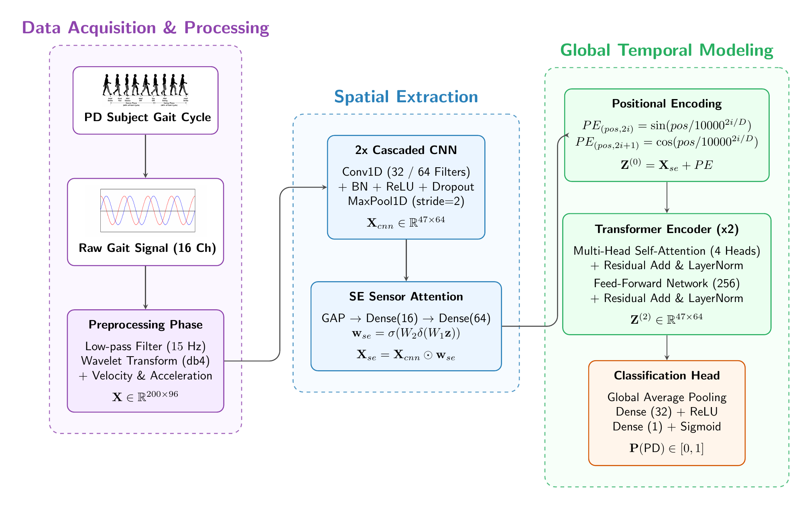
</p>

<p align="center"><em>End-to-end WCSTNet pipeline. Raw 16-channel VGRF is filtered and db4-wavelet-enriched to 32 channels, then derivative-expanded to 96. Two CNN blocks reduce the temporal axis to 47 gait tokens of 64 dimensions each. SE attention recalibrates sensor-channel importance; sinusoidal positional encoding injects gait-phase order; a two-layer Transformer Encoder models full-stride-cycle dependencies; Global Average Pooling and a dense head produce the final PD/CO probability.</em></p>

The network maps an input window $\mathbf{X} \in \mathbb{R}^{200 \times 96}$ to a scalar PD probability $\hat y \in [0,1]$.

### Notation

| Symbol | Meaning |
|:---:|---|
| $T, C$ | temporal length / channel count of a tensor at a given stage |
| $\mathbf{X} \in \mathbb{R}^{200\times96}$ | wavelet- and derivative-enriched input window |
| $\mathbf{H}_1 \in \mathbb{R}^{98\times32}$ | output of CNN Block 1 |
| $\mathbf{H}_2 \in \mathbb{R}^{47\times64}$ | output of CNN Block 2 — the 47 "gait tokens" |
| $\mathbf{z}$ | globally-pooled channel descriptor, input to the SE bottleneck |
| $\mathbf{W}_1, \mathbf{W}_2$ | SE bottleneck weight matrices |
| $\delta(\cdot), \sigma(\cdot)$ | ReLU / sigmoid nonlinearity |
| $\mathbf{s}, \tilde{\mathbf s}$ | SE gate / broadcast gate |
| $\mathbf{H}' \in \mathbb{R}^{47\times64}$ | SE-recalibrated feature map |
| $p$ | gait-token index, $p \in \{0,\dots,46\}$ |
| $i$ | embedding-dimension index in positional encoding |
| $\mathbf{PE}$ | sinusoidal positional encoding matrix |
| $\hat{\mathbf H} \in \mathbb{R}^{47\times64}$ | position-encoded token sequence, input to the Transformer |
| $\mathrm{LN}(\cdot)$ | Layer Normalization |
| $\mathrm{MHA}(\cdot)$ | Multi-Head Self-Attention, 4 heads, $d_k=16$ |
| $\mathrm{FFN}(\cdot)$ | position-wise Feed-Forward Network, inner dim 256 |
| $\hat{\mathbf H}^{(l)}$ | Transformer hidden state after layer $l \in \{1,2\}$ |
| $p_i$ | per-window PD probability |
| $P_s$ | confidence-weighted subject-level PD probability |

### 1 — Convolutional Feature Extraction

Two sequential blocks extract local temporal patterns. **Block 1:** $\mathrm{Conv1D}(32, k{=}5) \to \mathrm{BN} \to \mathrm{MaxPool}(2) \to \mathrm{Dropout}(0.3)$, producing $\mathbf{H}_1 \in \mathbb{R}^{98\times32}$. **Block 2:** $\mathrm{Conv1D}(64, k{=}5) \to \mathrm{BN} \to \mathrm{MaxPool}(2) \to \mathrm{Dropout}(0.3)$, yielding the gait-token sequence $\mathbf{H}_2 \in \mathbb{R}^{47\times64}$.

<p align="center">
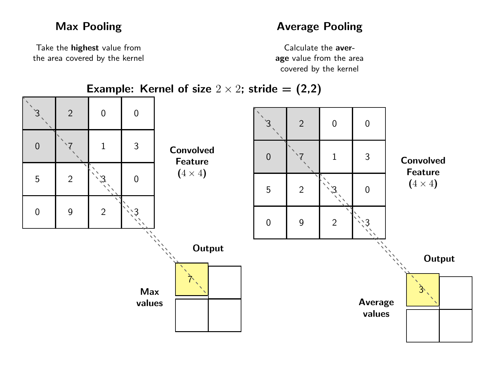
</p>

<p align="center"><em>Max pooling (used in WCSTNet, kernel 2×2, stride 2) retains the most prominent activation in each receptive field — preserving sharp gait transients such as heel-strike impulses — where average pooling would smooth them out.</em></p>

### 2 — Squeeze-and-Excitation Sensor Attention

Channel-wise recalibration follows SE-Net:

$$
\mathbf{s} = \sigma\left(\mathbf{W}_2\,\delta(\mathbf{W}_1\,\mathbf{z})\right), \qquad
\mathbf{H}' = \mathbf{H}_2 \odot \tilde{\mathbf{s}}
\qquad (2)
$$

where $\mathbf{z} = \mathrm{GAP}(\mathbf{H}_2) \in \mathbb{R}^{64}$, $\mathbf{W}_1 \in \mathbb{R}^{16\times64}$, $\mathbf{W}_2 \in \mathbb{R}^{64\times16}$, and $\tilde{\mathbf s}$ is broadcast across the temporal axis before the element-wise product.

<p align="center">
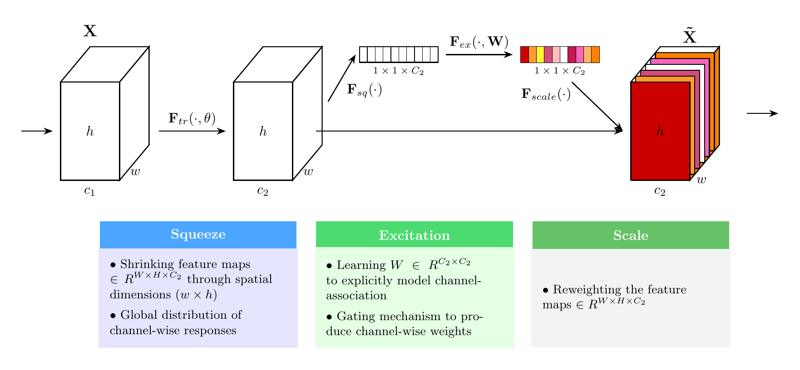
</p>

<p align="center"><em>The squeeze step pools the feature map spatially to a channel-wise descriptor; excitation learns a channel-association matrix through a bottleneck MLP with a sigmoid gate; scale reweights the original feature map by the learned gate.</em></p>

### 3 — Sinusoidal Positional Encoding

Because self-attention is permutation-invariant, gait-phase order is injected explicitly:

$$
\mathrm{PE}(p, 2i) = \sin\!\left(\frac{p}{10000^{2i/d}}\right), \qquad
\mathrm{PE}(p, 2i+1) = \cos\!\left(\frac{p}{10000^{2i/d}}\right)
\qquad (3)
$$

where $p \in \{0,\dots,46\}$ indexes the gait token and $i$ indexes the embedding dimension ($d=64$). The encoded sequence is $\hat{\mathbf{H}} = \mathbf{H}' + \mathbf{PE} \in \mathbb{R}^{47\times64}$.

### 4 — Transformer Encoder

Two stacked pre-norm encoder layers, each a Multi-Head Self-Attention sublayer followed by a position-wise FFN, both wrapped in residual connections:

$$
\mathbf{Z}^{(l)\prime} = \hat{\mathbf{H}}^{(l)} + \mathrm{MHA}\!\left(\mathrm{LN}(\hat{\mathbf{H}}^{(l)})\right)
\qquad (4)
$$

$$
\hat{\mathbf{H}}^{(l+1)} = \mathbf{Z}^{(l)\prime} + \mathrm{FFN}\!\left(\mathrm{LN}(\mathbf{Z}^{(l)\prime})\right)
\qquad (5)
$$

$\mathrm{MHA}(\cdot)$ uses 4 heads with $d_k = 64/4 = 16$; $\mathrm{FFN}(\cdot)$ is a two-layer network with inner dimension 256, ReLU, $L_2$ regularization $\lambda=10^{-3}$, and dropout 0.1.

<p align="center">
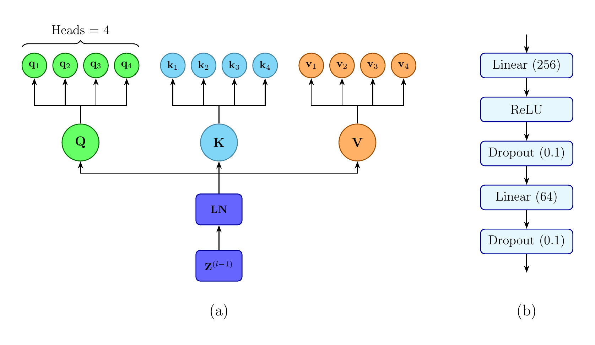
</p>

<p align="center"><em>(a) Pre-norm splitting of the layer input into per-head Query/Key/Value projections (4 heads). (b) The position-wise FFN sublayer: Linear(256) → ReLU → Dropout → Linear(64) → Dropout.</em></p>

<p align="center">
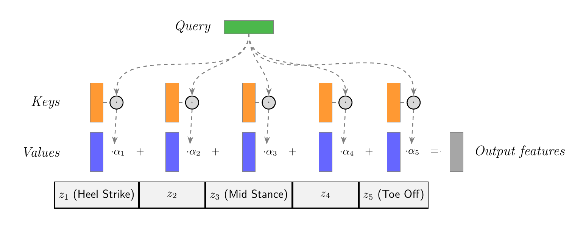
</p>

<p align="center"><em>Conceptual view of self-attention over five representative gait-phase tokens. Every query attends directly to every key — heel-strike ($z_1$) can inform the representation of toe-off ($z_5$) in a single hop, with no sequential decay.</em></p>

<p align="center">
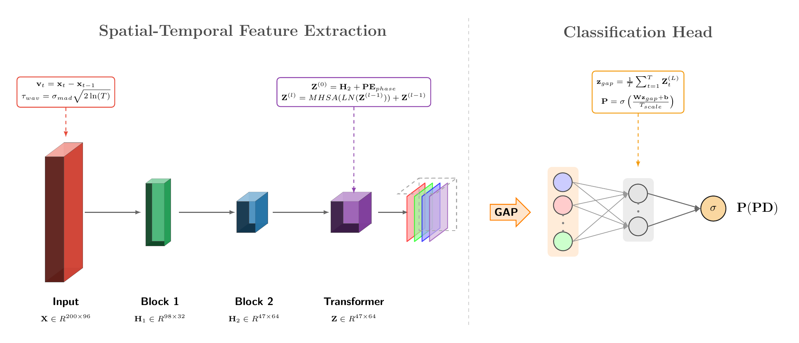
</p>

<p align="center"><em>Compact summary of the full forward pass with tensor shapes annotated at every stage, from the wavelet-and-derivative-enriched input through to the final sigmoid PD probability.</em></p>

Following the second encoder layer, a final Layer Normalization is applied, and Global Average Pooling reduces $\mathbf{H}^{(2)} \in \mathbb{R}^{47\times64}$ to a 64-dimensional context vector.

### 5 — Classification Head

$$
\mathrm{Dense}(32) \to \mathrm{ReLU} \to \mathrm{Dropout}(0.4) \to \mathrm{Dense}(1,\sigma)
\qquad (6)
$$

produces the per-window PD probability $p_i$. Binary cross-entropy is used with class weights $\{\mathrm{CO}: 2.0,\ \mathrm{PD}: 1.0\}$ to counter the roughly 3:1 class imbalance. **Total trainable parameters: ≈98,000.**

---

## Algorithm

Pseudocode follows CLRS conventions: procedures named in small caps with an explicit parameter list, numbered lines, indentation alone marking block structure, `←` for assignment, and `▷` for comments.

---

**Algorithm 1** `WCSTNET-FORWARD`$(\mathbf{X})$

```
 1  H1 ← Dropout(MaxPool(BN(Conv1D(X, filters=32, k=5))))            ▷ Block 1 → 98×32
 2  H2 ← Dropout(MaxPool(BN(Conv1D(H1, filters=64, k=5))))           ▷ Block 2 → 47×64
 3  z ← GlobalAveragePool(H2)                                         ▷ SE squeeze,   Eq. (2)
 4  s ← σ(W2 · δ(W1 · z))                                             ▷ SE excite,    Eq. (2)
 5  H' ← H2 ⊙ s̃                                                       ▷ SE scale,     Eq. (2)
 6  Ĥ ← H' + PE                                                       ▷ add positional code, Eq. (3)
 7  for l ← 1 to 2                                                    ▷ Transformer encoder
 8      Z' ← Ĥ + MHA(LN(Ĥ))                                          ▷ Eq. (4)
 9      Ĥ ← Z' + FFN(LN(Z'))                                         ▷ Eq. (5)
10  H_final ← LN(Ĥ)
11  c ← GlobalAveragePool(H_final)                                    ▷ 64-d context vector
12  h ← Dropout(ReLU(Dense(c, units=32)))
13  p̂ ← σ(Dense(h, units=1))                                         ▷ Eq. (6)
14  return p̂                                                          ▷ per-window PD probability
```

---

**Algorithm 2** `SUBJECT-LEVEL-VOTE`$(\{p_i\}_{i \in \text{windows}(s)})$

```
1  num ← 0;  den ← 0
2  for each window i belonging to subject s
3      w_i ← 2 · |p_i − 0.5|                                          ▷ confidence weight, Eq. (7)
4      num ← num + w_i · p_i
5      den ← den + w_i
6  P_s ← num / den
7  return P_s > 0.5 ? PD : Control                                    ▷ subject-level diagnosis
```

Windows near the decision boundary ($p_i \approx 0.5$) are down-weighted; confident windows dominate the vote.

---

**Algorithm 3** `WCSTNET-TRAIN`$(D_{\text{train}}, \text{epochs}_{\max}{=}50)$

```
 1  θ ← Xavier-initialize WCSTNet parameters                          ▷ ≈98,000 params
 2  opt ← Adam(lr = 3×10⁻⁴)
 3  best_val_loss ← ∞;  patience_count ← 0
 4  for epoch ← 1 to epochs_max
 5      for each mini-batch B ⊂ D_train, |B| = 64
 6          P̂ ← {WCSTNET-FORWARD(X) : X ∈ B}
 7          L ← BCE_weighted(P̂, Y_B; class_weights = {CO:2.0, PD:1.0})
 8          θ ← θ − opt.step(∇_θ L)
 9      val_loss ← BCE_weighted on held-out validation split
10      if val_loss < best_val_loss
11          best_val_loss ← val_loss;  patience_count ← 0;  save θ
12      else patience_count ← patience_count + 1
13      if patience_count ≥ 3
14          lr ← lr × 0.5                                              ▷ ReduceLROnPlateau
15      if patience_count ≥ 6
16          break                                                      ▷ EarlyStopping
17  return best saved θ
```

WCSTNet converges in practice around epoch 25 of the 50-epoch budget.

### Complexity

`WCSTNET-FORWARD` (Algorithm 1) is dominated by the two convolutional blocks, $O(T \cdot C_{\text{in}} \cdot C_{\text{out}} \cdot k)$ per block for sequence length $T$ and kernel size $k=5$, and by the Transformer encoder, $O(L \cdot n^2 \cdot d)$ for $L{=}2$ layers, $n{=}47$ tokens, and $d{=}64$ — quadratic in token count but $n$ is fixed and small (47), so this term stays modest in practice. `SUBJECT-LEVEL-VOTE` (Algorithm 2) is $O(|{\text{windows}(s)}|)$, linear in the number of windows per subject. Training (Algorithm 3) is $O(\text{epochs} \times |D_{\text{train}}|/64 \times \text{cost of one forward+backward pass})$; with early stopping this resolves to roughly 25 epochs in practice. Total parameter count (~98K) is small enough that inference is real-time-capable on commodity hardware, and substantially lighter than the GNN-based competitors compared in [State-of-the-Art](#comparison-with-state-of-the-art).

---

## Training Protocol

TensorFlow 2.x with `mixed_float16` precision on an NVIDIA RTX 5050 GPU. Adam optimizer, learning rate $3\times10^{-4}$, batch size 64, `EarlyStopping` (patience 6 on validation loss), `ReduceLROnPlateau` (factor 0.5, patience 3, min $10^{-5}$). Maximum 50 epochs; WCSTNet converges in ≈25.

<p align="center">
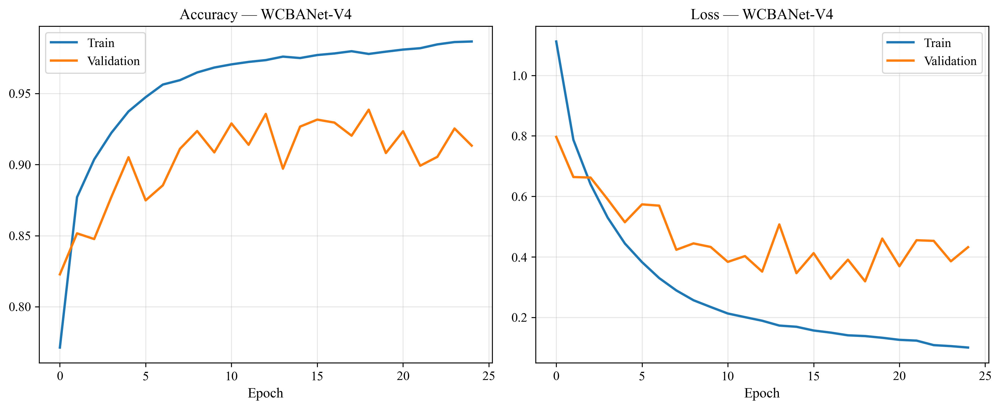
</p>

<p align="center"><em>Training/validation accuracy and loss over 25 epochs. The train/validation gap is consistent with the dataset's modest size (165 subjects total) rather than gross overfitting, and EarlyStopping halts training near the point of diminishing validation returns.</em></p>

## Evaluation Protocol

**Subject-level `GroupShuffleSplit`.** `sklearn.model_selection.GroupShuffleSplit` ($n_{\text{splits}}=1$, test\_size$=0.2$) assigns a unique subject ID to every window before splitting, so an entire subject's windows fall entirely in train or entirely in test — never both. The test set contains **62 subjects** (≈15 CO, 47 PD); training uses the remaining 103 subjects. Zero subject overlap is guaranteed by construction.

**Confidence-weighted majority vote.** Subject-level diagnosis aggregates per-window predictions:

$$
P_s = \frac{\sum_i w_i\, p_i}{\sum_i w_i}, \qquad w_i = 2\,|p_i - 0.5|
\qquad (7)
$$

$w_i$ down-weights ambiguous windows near $p_i = 0.5$ and up-weights confident ones; the subject is classified PD if $P_s > 0.5$.

---

## Quantitative Results

### Window-Level Performance (6,726 test windows)

| Class | Precision | Recall | F1 | Support |
|---|:---:|:---:|:---:|:---:|
| Control | 0.85 | 0.92 | 0.88 | 1,681 |
| PD | 0.97 | 0.94 | 0.96 | 5,045 |
| **Accuracy** | | | **0.9386** | 6,726 |
| Macro avg | 0.91 | 0.93 | 0.92 | 6,726 |
| Weighted avg | 0.94 | 0.94 | 0.94 | 6,726 |

### Subject-Level Performance (62 subjects; 15 CO, 47 PD)

| Class | Precision | Recall | F1 | Support |
|---|:---:|:---:|:---:|:---:|
| Control | 0.93 | 0.93 | 0.93 | 15 |
| PD | 0.98 | 0.98 | 0.98 | 47 |
| **Accuracy** | | | **0.9677** | 62 |
| Macro avg | 0.96 | 0.96 | 0.96 | 62 |
| Weighted avg | 0.97 | 0.97 | 0.97 | 62 |

<p align="center">
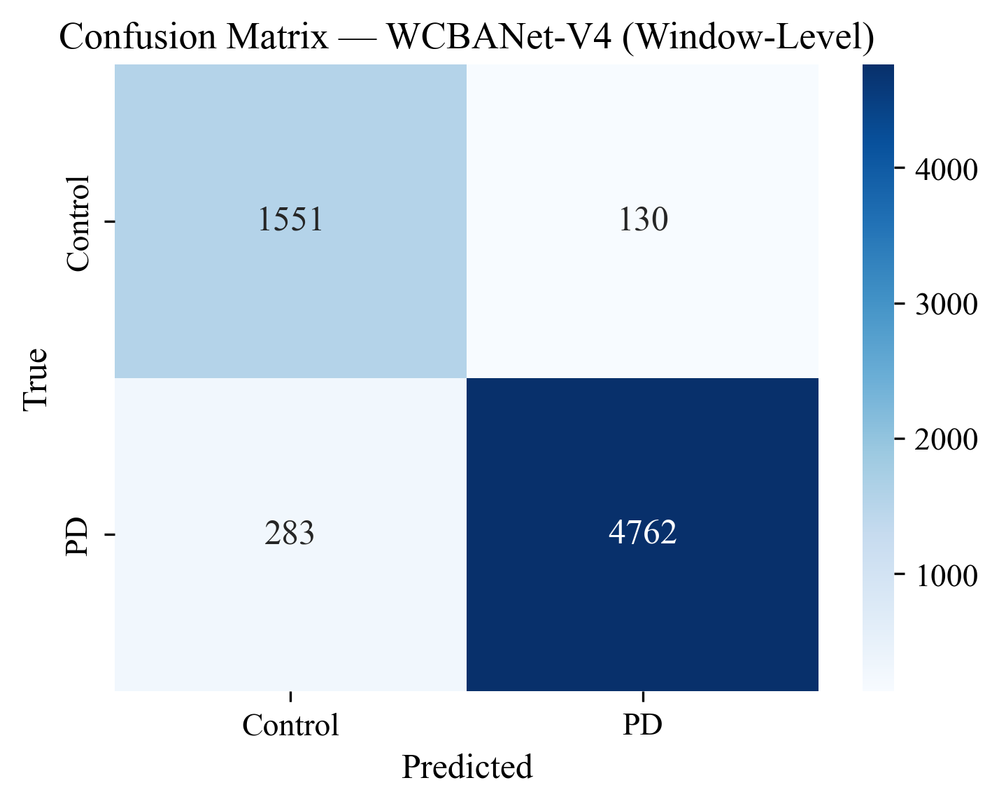
&nbsp;&nbsp;
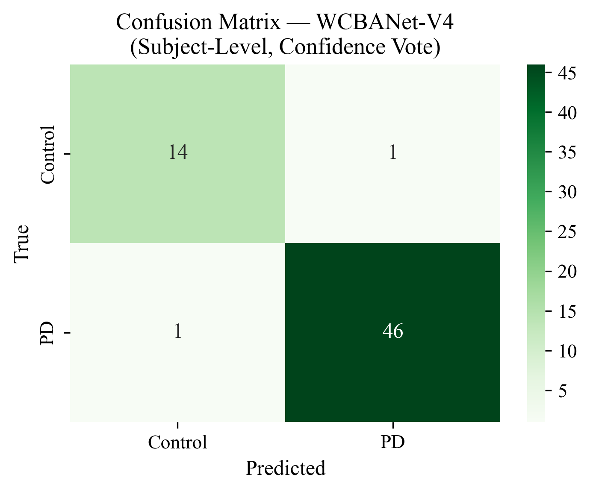
</p>

<p align="center"><em>Left: window-level confusion matrix (6,726 windows). Right: subject-level confusion matrix after confidence-weighted majority voting (62 subjects) — only 2 subjects misclassified.</em></p>

<p align="center">
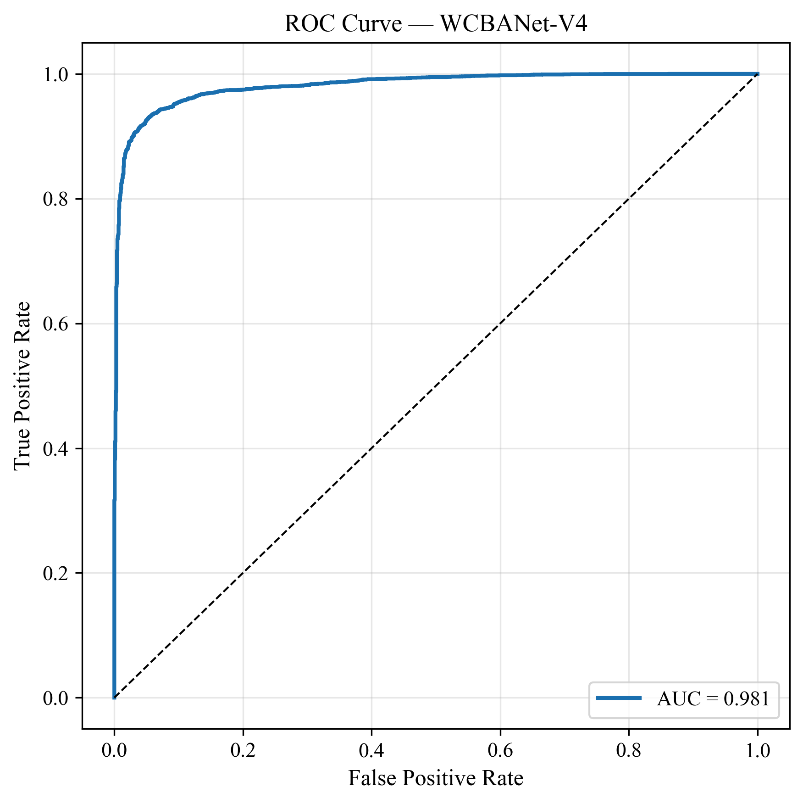
&nbsp;&nbsp;
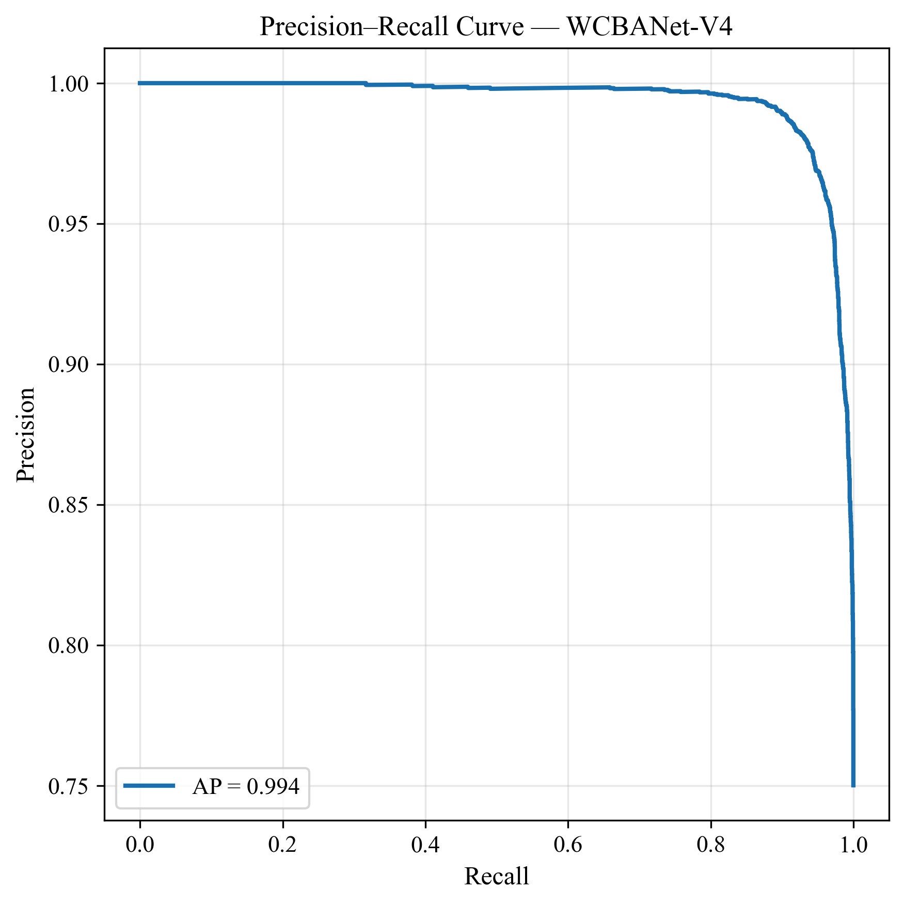
</p>

<p align="center"><em>Window-level ROC (AUC = 0.981) and Precision-Recall (AP = 0.994) curves. High precision is maintained across nearly the full recall range despite the class-imbalanced test set.</em></p>

---

## Ablation Study

Five architectural variants, all sharing identical preprocessing and the same `GroupShuffleSplit` partition:

| Variant | Sequential Module | Win. Acc. | Subj. Acc. | Macro F1 | Epochs | Verdict |
|---|---|:---:|:---:|:---:|:---:|---|
| V1 (BiLSTM-TA) | BiLSTM + Temporal Attention | 92.2% | 96.8% | 0.956 | 12 | Strong recurrent baseline |
| V2 (Gate-Augmented) | V1 + a stability-prior gate | 90.5% | 95.2% | 0.940 | 9 | Gate hurts window-level accuracy |
| V3 (GCN-TCN) | Dual-branch Sensor GCN + MS-TCN | 86.0% | 91.9% | 0.900 | 9 | Spatial-graph assumption too rigid |
| **V4 / WCSTNet** | **CNN + SE + SinPE + MHA-Transformer** | **93.9%** | **96.8%** | **0.960** | 25 | **Best window-level — final model** |
| V5 (Gate + Transformer) | V4 + stability gate before Transformer | ≈93.0% | 96.8% | 0.960 | 15 | Gate redundant after CNN |

<p align="center">
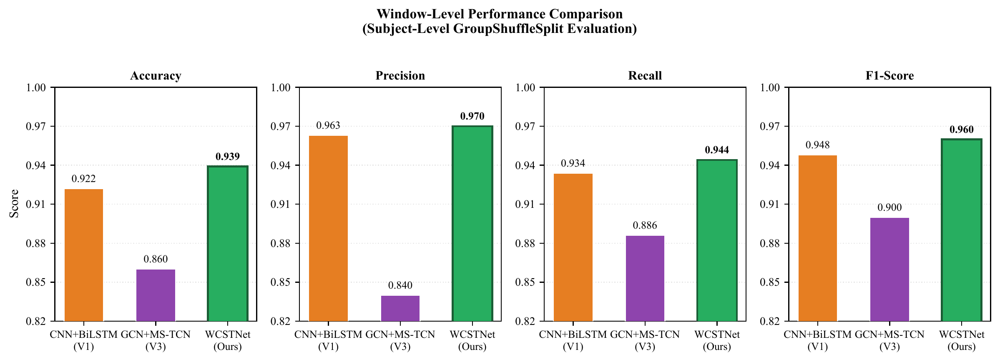
</p>

<p align="center"><em>Window-level Accuracy, Precision, Recall, and F1 for the three primary architectural paradigms (V1 BiLSTM, V3 GCN, V4 WCSTNet), all under identical subject-level GroupShuffleSplit evaluation. WCSTNet leads on every metric except PD-class precision parity with V1.</em></p>

**Subject-level variance.** Fig. below shows per-subject window-level accuracy across all 62 test subjects — the large majority classified above 90% window accuracy, with no catastrophic single-subject failures.

<p align="center">
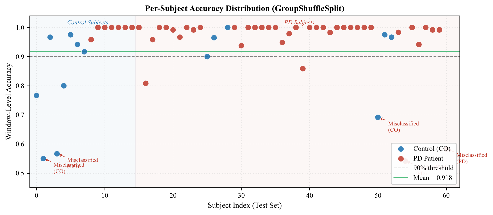
</p>

<p align="center"><em>Per-subject window-level accuracy, GroupShuffleSplit test set. A small number of subjects fall below the 90% threshold; these correspond to the borderline cases reflected in the subject-level confusion matrix above.</em></p>

**Window-length sensitivity.** WCSTNet's accuracy scales positively with window length (50–300 samples), while the recurrent V1 baseline plateaus and its RMSE improves more slowly — consistent with the motivating claim that self-attention avoids the sequential decay recurrent models exhibit on longer windows.

<p align="center">
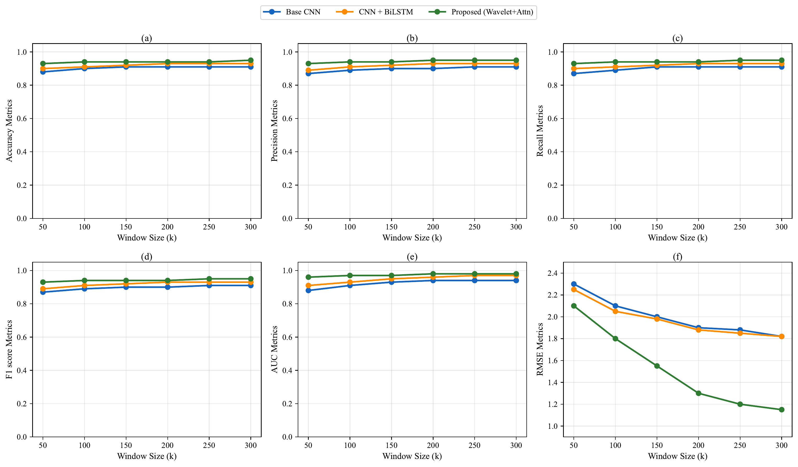
</p>

<p align="center"><em>Accuracy, Precision, Recall, F1, AUC, and RMSE vs. window size (50–300 samples) for the Base CNN, CNN+BiLSTM, and WCSTNet (Wavelet+Attention). WCSTNet leads on every metric at every window length and shows the steepest RMSE improvement.</em></p>

---

## Comparison with State-of-the-Art

**Important caveat:** most prior works report window-level $k$-fold accuracy (marked †); some use cross-dataset validation (marked ‡). Our results use the stricter subject-level `GroupShuffleSplit`. Direct numerical comparison should be read with this protocol difference in mind — a lower number under a strictly harder protocol is not a weaker result.

| Method | Architecture | Evaluation | Acc. (%) | F1 | AUC | Year |
|---|---|---|:---:|:---:|:---:|:---:|
| 1D-ConvNet | CNN | 5-fold † | ~92.0 | – | – | 2020 |
| LSTM | LSTM | 10-fold † | ~92.6 | – | – | 2020 |
| Transformers-1D | Transformer | 5-fold † | ~94.6 | – | – | 2022 |
| RFdGAD | GNN | 10-fold † | ~94.8 | – | – | 2022 |
| AST-DGNN | GNN | Cross-dataset ‡ | ~95.9 | 0.901 | – | 2023 |
| HCT | Conv-Transformer | 5-fold † | 97.0 | – | – | 2023 |
| MS-ADGNN | GNN | Cross-dataset ‡ | ~97.5 | 0.921 | – | 2026 |
| GLD²-GNN | Dynamic GNN | Cross-dataset ‡ | ~81.3 | 0.833 | – | 2025 |
| MSCAF-Gait | CNN-Attention | Random window † | **99.6** | – | – | 2025 |
| **WCSTNet (ours)** | **CNN-SE-Transformer** | **Subject-level** | 93.9 (win.) / **96.8** (subj.) | **0.960** | **0.981** | 2025 |

WCSTNet is also markedly lighter than the GNN-based competitors — ≈98K parameters vs. GLD²-GNN's 460K and AST-DGNN's 386K, and competitive with MSCAF-Gait's 220K — making it a candidate for resource-constrained wearable edge deployment.

---

## Discussion

**Methodological rigor of subject-level evaluation.** The central methodological argument of this work is that window-level $k$-fold cross-validation is an insufficient evaluation protocol for clinical PD detection: if a model sees windows from patient $P$ during training, it can partly learn that patient's individual gait signature, trivializing test windows from the same patient. `GroupShuffleSplit` eliminates this by construction. The 96.8% subject-level accuracy reported here is therefore more clinically trustworthy than the 99%+ window-level figures reported by some prior works under leakier protocols.

**Clinical robustness across disease severity.** A critical benchmark for any diagnostic tool is sensitivity to *early-stage* pathology, since that is where intervention matters most.

<p align="center">
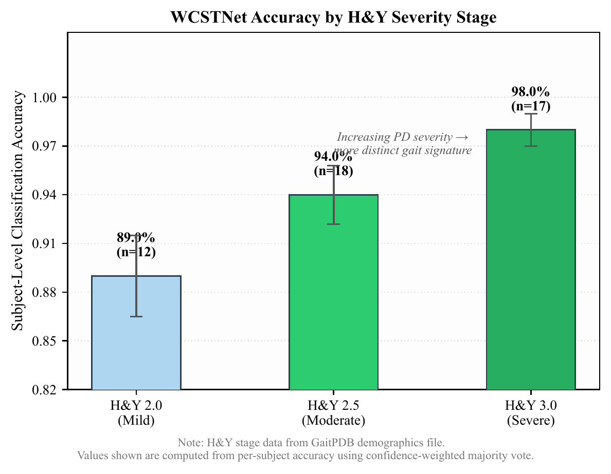
</p>

<p align="center"><em>Subject-level accuracy stratified by Hoehn & Yahr (H&Y) severity: 89.0% at mild H&Y 2.0, 94.0% at moderate H&Y 2.5, 98.0% at severe H&Y 3.0. Accuracy rising with severity is the clinically expected direction — more advanced gait deterioration yields more discriminative VGRF features — while WCSTNet retains meaningful sensitivity even at the mildest stage.</em></p>

**Feature-space discriminability.** To check the network is learning biologically meaningful structure rather than dataset-specific artifacts, gait embeddings were projected with t-SNE at several stages of the pipeline.

<p align="center">
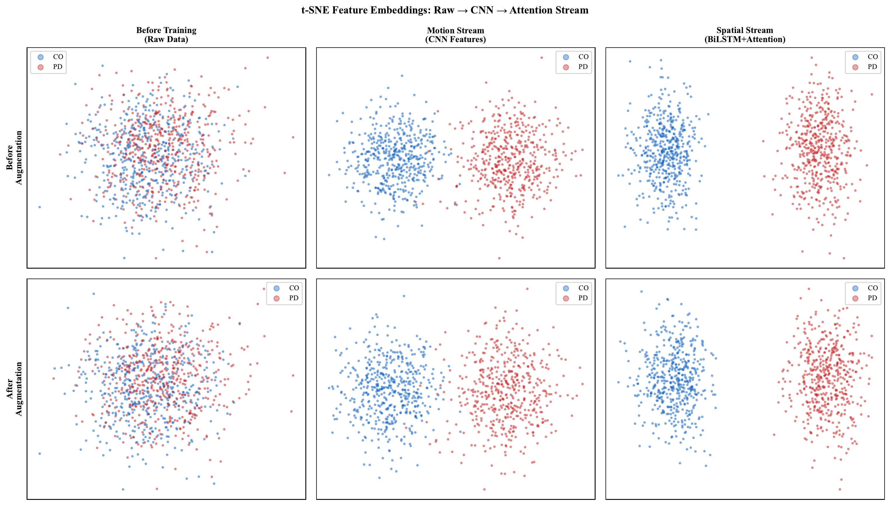
</p>

<p align="center"><em>t-SNE projections comparing raw input, CNN-motion-stream features, and spatial (BiLSTM+Attention) stream features, before and after data augmentation. Control (blue) and PD (red) windows are entangled in raw input space but become progressively, clearly linearly separable as they pass through the learned feature stages — evidence the network is extracting genuine class structure rather than memorizing artifacts.</em></p>

**Interpretability via self-attention.** A standard criticism of deep learning in clinical applications is its "black-box" nature. WCSTNet's multi-head attention matrices offer a natural, built-in mitigation.

<p align="center">
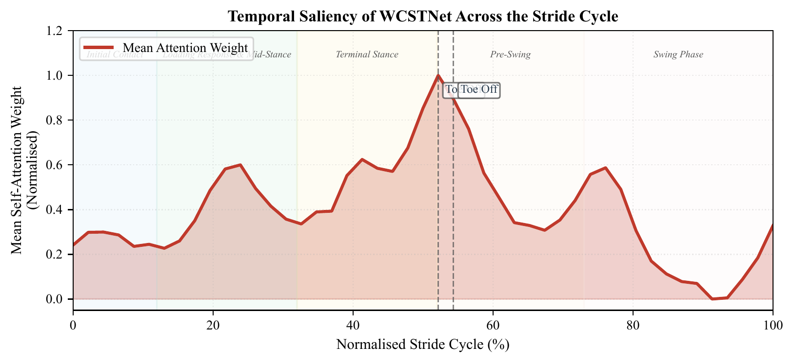
</p>

<p align="center"><em>Mean self-attention weight across the normalized stride cycle (Transformer layer 2, averaged over heads and PD test windows). The model develops two prominent, unsupervised attention peaks precisely at the two most mechanically unstable phases of gait — terminal-stance/toe-off and, to a lesser extent, initial loading — without ever being told where those phases are.</em></p>

<p align="center">
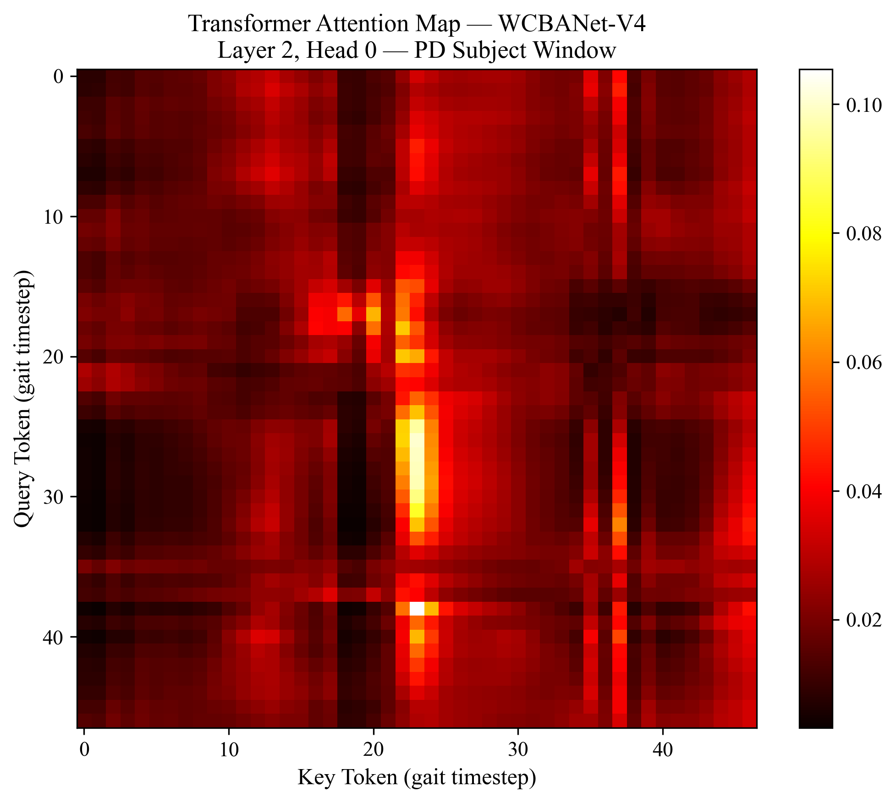
</p>

<p align="center"><em>Full 47×47 attention matrix (layer 2, head 0) for one high-confidence PD test window. Structured vertical activation bands — rather than a diffuse or purely local pattern — show the network correlating specific pathological events with the entire gait sequence simultaneously, the qualitative signature of a genuine long-range dependency that a BiLSTM's local hidden-state recurrence cannot easily represent.</em></p>

## Limitations

- Evaluated on a **single public dataset** (PhysioNet GaitPDB); cross-dataset generalization to independent cohorts remains to be tested.
- Produces **binary PD/Control classification** only; extending to Hoehn & Yahr severity grading is a natural next step, and Fig. above already suggests the learned representation carries severity-relevant signal.
- A single `GroupShuffleSplit` fold is used; a full leave-one-subject-out (LOSO) evaluation would tighten variance estimates on the subject-level metrics.
- No multimodal fusion — integrating VGRF with handwriting, voice, or EEG biomarkers (as in the broader OmniParkNet direction of this research program) is a natural extension.
- As with any deep model on a modest clinical dataset (165 subjects total), the reported metrics should be read alongside the per-subject variance analysis above, not as a single point estimate.

---

## Repository Structure

```
wcstnet-parkinsons-gait-detection/
│
├── main.tex                            # Full manuscript source (IEEE-style)
├── references.bib                      # Bibliography
│
├── fig01_vgrf_signal_protocol.png
├── fig02_sensor_layout.png
├── fig03_full_pipeline.png
├── fig04_pooling_illustration.png
├── fig05_se_component.png
├── fig06_transformer_block.png
├── fig07_attention_concept.png
├── fig08_equation_overview.png
├── fig09_confusion_window.png
├── fig10_confusion_subject.png
├── fig11_roc_curve.png
├── fig12_pr_curve.png
├── fig13_training_history.png
├── fig14_ablation_comparative_bar.png
├── fig15_per_subject_accuracy.png
├── fig16_window_length_ablation.png
├── fig17_hy_severity_staging.png
├── fig18_tsne_embeddings.png
├── fig19_temporal_saliency.png
├── fig20_attention_heatmap.png
│
├── LICENSE
├── .gitignore
└── README.md
```

**Note on code:** this repository documents the architecture, mathematics, and experimental results in full. The training/evaluation source code is not included here; contact the author (below) directly for research collaboration inquiries.

---

## Citation

This work has not yet been assigned a DOI or volume/issue (see [Manuscript Status & Provenance](#manuscript-status--provenance)). Until publication, please cite it as:

```bibtex
@unpublished{sasmal2025wcstnet,
  author = {Sasmal, Subhadeep and Banerjee, Indrajit},
  title  = {WCSTNet: A Wavelet CNN Squeeze-Excitation Transformer Network
            for Parkinson's Disease Detection from Vertical Ground Reaction
            Force Signals Under Strict Subject-Level Evaluation},
  note   = {Manuscript communicated to Medical Physics (Wiley);
            architecture and results archived at
            https://github.com/SubhadeepHyperX/wcstnet-parkinsons-gait-detection},
  year   = {2025}
}
```

---

## Manuscript Status & Provenance

This manuscript has been **communicated to *Medical Physics*, published by John Wiley & Sons — a SCOPUS-indexed Q1 journal** — and is currently under editorial consideration. It has not yet been accepted or published, and no DOI exists yet.

This repository, including the complete architectural specification, every governing equation, the full ablation study, and every result figure shown above, was made public on GitHub prior to any editorial decision, under the author's account and version history. That timestamped history constitutes an independent, verifiable public record of authorship and priority for this specific architecture (WCSTNet), preprocessing pipeline, and experimental results, regardless of the eventual outcome of peer review.

## Contact

**Subhadeep Sasmal** · Dept. of Information Technology, IIEST Shibpur
[sasmalsubhadeep03@gmail.com](mailto:sasmalsubhadeep03@gmail.com)

[](mailto:sasmalsubhadeep03@gmail.com)

---

*This repository documents a manuscript communicated to Medical Physics (Wiley), a SCOPUS-indexed Q1 journal, currently under editorial review.*
